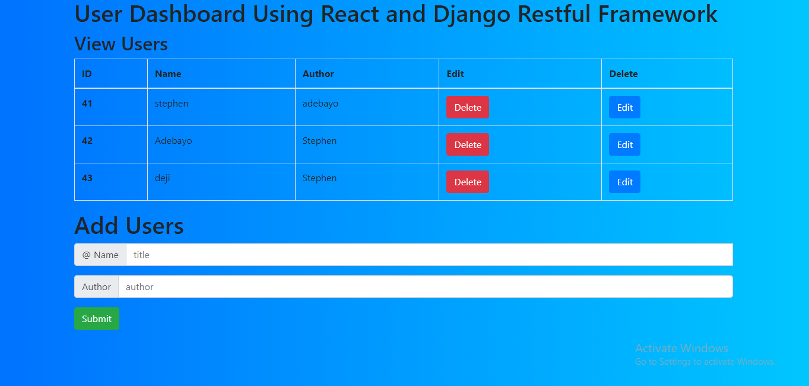

## User Dashboard Using React and Django Restful Framework

### `npm start for front-end`

Runs the app in the development mode.\
Open [http://localhost:3000](http://localhost:3000) to view it in the browser.

The page will reload if you make edits.\
You will also see any lint errors in the console.

### `python manage.py runserver for backend Django restfull framework`

Runs the app in the development mode at the backend.\
Open [http://localhost:8000](http://localhost:8000) to view it in the browser.

The page will reload if you make edits.\
You will also see any lint errors in the console.
